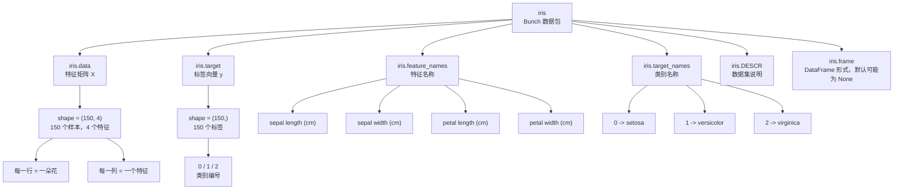
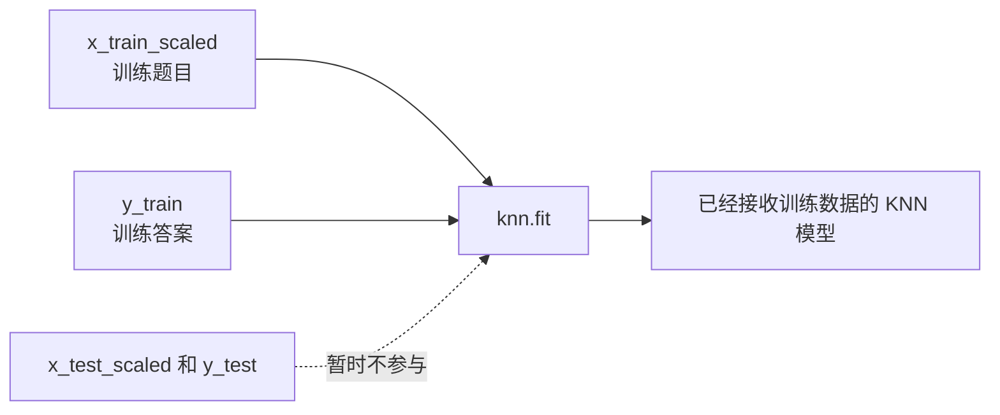
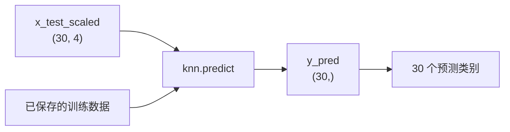

# KNN 鸢尾花案例学习路径

## 1. 当前学习位置

```text
机器学习概述 -> KNN 基本思想 -> 标准化 -> KNN 鸢尾花分类案例
```

鸢尾花案例是 KNN 分类算法的一个完整入门案例，适合把前面学过的几个概念串起来：

- 特征 `X`
- 标签 `y`
- 训练集和测试集
- 分类问题
- KNN 最近邻投票
- 标准化
- 模型训练、评估和预测

## 2. 案例背景

鸢尾花数据集中，每一条样本表示一朵鸢尾花。

每朵花有 4 个特征：

```text
萼片长度
萼片宽度
花瓣长度
花瓣宽度
```

每朵花有 1 个类别标签：

```text
setosa
versicolor
virginica
```

所以这个案例要解决的问题是：

```text
根据一朵花的 4 个数值特征，预测它属于哪一种鸢尾花。
```

## 3. 问题类型

这是一个有监督学习问题，因为数据中既有特征 `X`，也有标签 `y`。

这是一个分类问题，因为预测目标是离散类别，而不是连续数值。

```text
X = 花的 4 个特征
y = 花的类别
```

## 4. KNN 在本案例中的思路

```text
新来一朵花
-> 计算它和训练集中其他花的距离
-> 找到距离最近的 K 朵花
-> 看这 K 朵花大多数属于哪一类
-> 把新花预测成这个类别
```

## 5. 基本流程

```text
导包
-> 加载鸢尾花数据集
-> 查看数据集结构
-> 拆分特征 X 和标签 y
-> 划分训练集和测试集
-> 标准化
-> 创建 KNN 分类模型
-> 模型训练
-> 模型评估
-> 模型预测
```

## 6. 需要导入的工具

```python
from sklearn.datasets import load_iris
from sklearn.model_selection import train_test_split
from sklearn.preprocessing import StandardScaler
from sklearn.neighbors import KNeighborsClassifier
```

对应作用：

- `load_iris`：加载鸢尾花数据集
- `train_test_split`：划分训练集和测试集
- `StandardScaler`：对特征做标准化
- `KNeighborsClassifier`：创建 KNN 分类模型

## 7. 当前进度

目前已经完成：

```text
加载数据 -> 理解 Bunch -> 拆分 X 和 y -> 划分训练集和测试集
-> 标准化 -> KNN 训练 -> 预测与准确率评估 -> 二维可视化
```

按照黑马新版课程顺序，下一步是：

```text
交叉验证与网格搜索 -> 手写数字识别综合案例 -> 线性回归
```

## 8. 加载鸢尾花数据集

导包之后，使用 `load_iris()` 加载数据集：

```python
iris = load_iris()
```

`iris` 中常用的内容有：

- `iris.data`：特征矩阵 `X`
- `iris.target`：标签向量 `y`
- `iris.feature_names`：特征名称
- `iris.target_names`：类别名称

在鸢尾花案例中：

```text
iris.data   -> 150 朵花的 4 个特征
iris.target -> 150 朵花对应的类别编号
```

所以后面会把数据拆成：

```python
x = iris.data
y = iris.target
```

重点理解：

```text
x 是二维特征矩阵，形状是 150 x 4
y 是一维标签向量，长度是 150
```

## 9. 查看数据集结构

加载数据集后，先不要急着训练模型，要先观察数据结构。

常看的内容：

```python
print(iris.data)
print(iris.target)
print(iris.feature_names)
print(iris.target_names)
```

### 1. `iris.data`

`iris.data` 是特征矩阵，也就是 `X`。

它的结构是：

```text
150 行，4 列
```

含义是：

```text
150 个样本，每个样本 4 个特征
```

其中一行可以理解成一朵花：

```text
[萼片长度, 萼片宽度, 花瓣长度, 花瓣宽度]
```

### 2. `iris.target`

`iris.target` 是标签向量，也就是 `y`。

它里面存的是类别编号：

```text
0
1
2
```

这些数字不是大小关系，只是类别代号。

### 3. `iris.target_names`

`iris.target_names` 表示类别编号对应的真实类别名称：

```text
0 -> setosa
1 -> versicolor
2 -> virginica
```

所以如果 `iris.target` 中某个值是 `0`，表示这朵花的类别是 `setosa`。

### 4. `iris.feature_names`

`iris.feature_names` 表示 4 个特征分别叫什么。

在鸢尾花数据集中，4 个特征是：

```text
sepal length (cm)
sepal width (cm)
petal length (cm)
petal width (cm)
```

对应中文理解：

```text
萼片长度
萼片宽度
花瓣长度
花瓣宽度
```

## 10. `iris` 这个 Bunch 的数据结构

`load_iris()` 返回的 `iris` 是一个 `Bunch` 对象，可以先把它理解成一个带属性访问功能的数据包。

```python
iris = load_iris()
```

结构可以理解为：



核心关系：

```text
iris.data   -> X，模型输入
iris.target -> y，模型答案
```

## 11. 拆分特征和标签

理解 `iris` 这个 Bunch 数据包之后，下一步就是把特征和标签单独取出来。

```python
x = iris.data
y = iris.target
```

含义是：

```text
x -> 特征矩阵，也就是模型要看的题目
y -> 标签向量，也就是每道题对应的答案
```

在鸢尾花案例中：

```text
x.shape = (150, 4)
y.shape = (150,)
```

其中：

```text
x 有 150 行，表示 150 个样本
x 有 4 列，表示每个样本有 4 个特征
y 有 150 个值，表示每个样本对应 1 个类别标签
```

可以把 `x` 和 `y` 的对应关系理解成：

```text
x[0] -> 第 1 朵花的 4 个特征
y[0] -> 第 1 朵花的类别答案

x[1] -> 第 2 朵花的 4 个特征
y[1] -> 第 2 朵花的类别答案
```

也就是说，`x` 和 `y` 是按行一一对应的。

## 12. NumPy 基础说明

`ndarray`、`shape`、`ndim`、`size`、数组切片和 `reshape` 已经单独整理到：

```text
NumPy_机器学习基础笔记.md
```

这部分属于机器学习通用基础，不只服务于鸢尾花案例，所以不再全部放在本笔记里。

## 13. 下一步学习路线

理解完 `x`、`y`、`shape` 和切片之后，就可以继续进入完整 KNN 鸢尾花流程：

```text
1. 划分训练集和测试集
2. 对特征做标准化
3. 创建 KNeighborsClassifier
4. 使用训练集训练模型
5. 使用测试集评估模型
6. 输入一朵新花的数据，让模型预测类别
```

下一段代码会从这里开始：

```python
from sklearn.model_selection import train_test_split

x_train, x_test, y_train, y_test = train_test_split(
    x,
    y,
    test_size=0.2,
    random_state=22
)

print(x_train.shape)
print(x_test.shape)
print(y_train.shape)
print(y_test.shape)
```

重点观察：

```text
x_train 和 x_test 仍然是二维特征矩阵
y_train 和 y_test 仍然是一维标签向量
```

## 14. 划分训练集和测试集

```text
训练集 -> 用来让模型学习
测试集 -> 用来检查模型面对陌生数据的表现
```

鸢尾花共有 150 个样本，`test_size=0.2` 表示训练集有 120 个样本，测试集有 30 个样本。

```text
x_train 与 y_train 配对
x_test  与 y_test 配对
```

`random_state=22` 用于固定随机划分结果。数字本身没有特殊含义，只要数字相同，每次划分结果就相同。

## 15. 标准化训练集和测试集

KNN 根据距离寻找邻居，因此需要避免某个数值范围较大的特征过度影响距离。

标准化器的正确使用顺序：

```text
1. 从 x_train 计算每一列的均值和标准差
2. 使用这些参数转换 x_train
3. 继续使用同一组参数转换 x_test
```

对应关系：

```text
x_train -> fit_transform：学习参数并转换
x_test  -> transform：只转换，不重新学习参数
```

关键原则：

> 标准化参数只能从训练集学习。测试集必须使用训练集生成的标准化模板，否则会发生数据泄漏。

标准化只处理特征 `x`，不处理分类标签 `y`。标准化前后数组形状不变：

```text
x_train: (120, 4) -> (120, 4)
x_test:   (30, 4) ->  (30, 4)
```

标准化会分别处理 4 个特征列，而不是把所有数值混在一起计算。

## 16. 创建 KNN 分类器

完成数据划分和标准化之后，可以创建一个 KNN 分类器：

```python
knn = KNeighborsClassifier(n_neighbors=5)
```

含义：

```text
KNeighborsClassifier -> KNN 分类模型
knn                  -> 保存这个模型对象的变量名
n_neighbors=5        -> 预测时寻找距离最近的 5 个训练样本
```

如果 5 个邻居的类别分别是：

```text
setosa, setosa, versicolor, setosa, versicolor
```

投票结果为：

```text
setosa:     3 票
versicolor: 2 票

最终预测 -> setosa
```

此时只是创建了分类器，还没有把训练数据交给它，因此模型还没有完成训练。

`n_neighbors` 就是 KNN 中的 `K`。K 太小容易受个别样本影响，K 太大则可能忽略局部特征；案例先使用 `5`，后面再讨论如何选择更合适的 K。

## 17. 使用训练集训练模型

先把标准化结果分别保存下来：

```python
scaler = StandardScaler()
x_train_scaled = scaler.fit_transform(x_train)
x_test_scaled = scaler.transform(x_test)
```

然后把训练集交给 KNN 分类器：

```python
knn.fit(x_train_scaled, y_train)
```

传入的两部分数据是：

```text
x_train_scaled -> 标准化后的训练特征，也就是题目
y_train        -> 训练样本对应的类别，也就是答案
```

训练时不使用 `x_test_scaled` 和 `y_test`。它们要留到模型训练完成后，用于独立测试模型。

KNN 属于惰性学习算法。调用 `fit` 时，它主要保存训练特征和标签；真正大量计算样本距离的工作发生在预测阶段。

这一阶段的数据流：



## 18. 使用测试集进行预测

模型训练完成后，把标准化后的测试特征交给模型：

```python
y_pred = knn.predict(x_test_scaled)
```

含义：

```text
x_test_scaled -> 30 朵测试花的 4 个标准化特征
knn.predict    -> 为每朵花寻找最近的 5 个训练样本并投票
y_pred         -> 模型预测出的 30 个类别编号
```

预测结果是一维数组：

```text
y_pred.shape = (30,)
```

数组中的每个数字代表一种鸢尾花：

```text
0 -> setosa
1 -> versicolor
2 -> virginica
```

可以查看类别编号和类别名称：

```python
print(y_pred)
print(iris.target_names[y_pred])
```

预测时只传入 `x_test_scaled`，不能把 `y_test` 交给模型。`y_test` 是测试集的正确答案，下一步才用它与 `y_pred` 对比并评估模型。



### 注释：什么是惰性学习

惰性学习（Lazy Learning）是指模型在训练阶段不进行实际的泛化或模式提取，而是直接存储训练数据。只有在预测阶段，模型才会根据输入的新样本计算与训练数据的距离或相似度来做出预测。

为什么要这样，惰性学习的特点：

```text
fit 阶段：
保存 x_train 和 y_train

predict 阶段：
1. 计算新样本与训练样本的距离
2. 找到最近的 K 个邻居
3. 根据邻居投票
4. 得到预测类别
```

惰性学习的特点：

```text
训练速度通常较快
需要保存训练数据
预测时计算量较大
训练数据越多，预测可能越慢
```

## 19. 评估模型

```python
accuracy = knn.score(x_test_scaled, y_test)
```

本案例的测试集共有 30 个样本，其中 28 个预测正确、2 个预测错误，准确率为 `93.33%`。

## 20. 数据可视化

鸢尾花有 4 个特征，但普通散点图只有两个坐标轴，因此选择区分度较明显的两个花瓣特征：

```text
横轴 -> petal length，花瓣长度
纵轴 -> petal width，花瓣宽度
```

可视化包含两张图：

```text
左图 -> 全部 150 个样本的真实类别分布
右图 -> 30 个测试样本的预测类别分布
红色叉号 -> 预测错误的测试样本
```

绘图使用原始厘米数据，使坐标含义容易理解；KNN 训练和预测仍然使用标准化后的数据。

生成的图片：

```text
KNN_iris_visualization.png
```

## 21. 本案例与线性代数、线性回归的联系

### 21.1 四维特征空间

每朵花的 4 个特征组成一个向量：

```text
x_i = [萼片长度, 萼片宽度, 花瓣长度, 花瓣宽度]
```

因此一朵花可以看作 `R^4` 中的一个点，整个 `X` 是 150 个四维向量按行堆叠得到的矩阵。

KNN 预测时计算：

```text
||x_test - x_i||_2
```

这就是差向量的二范数。

### 21.2 标准化改变坐标轴尺度

`StandardScaler` 对 `X` 的每一列做平移和缩放。它不改变矩阵 `(150, 4)` 的形状，但改变四维空间各坐标轴的单位，从而改变欧氏距离。

### 21.3 二维绘图是一种坐标选择

当前可视化从 4 个特征中选取花瓣长度和花瓣宽度：

```text
R^4 -> R^2
```

这是线性映射意义下的坐标选择。图中看不到的两个萼片特征仍然参加 KNN 的训练和预测，所以二维图只是模型的一个视图，不是完整的四维决策空间。

它和线性回归中的正交投影需要区分：

```text
Iris 绘图：丢弃两个坐标，只为可视化
线性回归：把标签 y 投影到 X 的列空间，最小化残差
```

### 21.4 从 KNN 回归过渡到线性回归

```text
KNN 回归：查看测试点附近的 K 个样本，取标签平均值
线性回归：求一组全局权重 w，用 Xw 预测所有样本
```

前者主要使用距离和范数，后者主要使用矩阵乘法、列空间、投影和最小二乘。

完整对应关系见：[线性回归与线性代数学习地图](../linear_regressor/线性回归与线性代数学习地图.md)。
