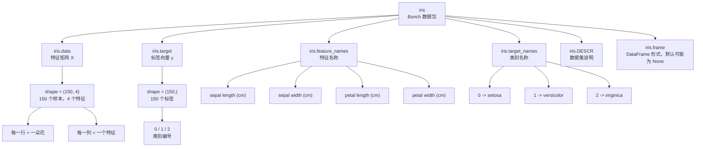

# KNN 鸢尾花案例学习路径

## 1. 当前学习位置

```text
机器学习概述 -> KNN 基本思想 -> 标准化 -> KNN 鸢尾花分类案例
```

鸢尾花案例是 KNN 分类算法的一个完整入门案例，适合把前面学过的几个概念串起来：

- 特征 `X`
- 标签 `y`
- 训练集和测试集
- 分类问题
- KNN 最近邻投票
- 标准化
- 模型训练、评估和预测

## 2. 案例背景

鸢尾花数据集中，每一条样本表示一朵鸢尾花。

每朵花有 4 个特征：

```text
萼片长度
萼片宽度
花瓣长度
花瓣宽度
```

每朵花有 1 个类别标签：

```text
setosa
versicolor
virginica
```

所以这个案例要解决的问题是：

```text
根据一朵花的 4 个数值特征，预测它属于哪一种鸢尾花。
```

## 3. 问题类型

这是一个有监督学习问题，因为数据中既有特征 `X`，也有标签 `y`。

这是一个分类问题，因为预测目标是离散类别，而不是连续数值。

```text
X = 花的 4 个特征
y = 花的类别
```

## 4. KNN 在本案例中的思路

```text
新来一朵花
-> 计算它和训练集中其他花的距离
-> 找到距离最近的 K 朵花
-> 看这 K 朵花大多数属于哪一类
-> 把新花预测成这个类别
```

## 5. 基本流程

```text
导包
-> 加载鸢尾花数据集
-> 查看数据集结构
-> 拆分特征 X 和标签 y
-> 划分训练集和测试集
-> 标准化
-> 创建 KNN 分类模型
-> 模型训练
-> 模型评估
-> 模型预测
```

## 6. 需要导入的工具

```python
from sklearn.datasets import load_iris
from sklearn.model_selection import train_test_split
from sklearn.preprocessing import StandardScaler
from sklearn.neighbors import KNeighborsClassifier
```

对应作用：

- `load_iris`：加载鸢尾花数据集
- `train_test_split`：划分训练集和测试集
- `StandardScaler`：对特征做标准化
- `KNeighborsClassifier`：创建 KNN 分类模型

## 7. 当前进度

目前已经讲到：

```text
背景 -> 基本知识 -> 导包
```

下一步：

```text
加载鸢尾花数据集，并理解 load_iris() 返回的数据结构。
```

## 8. 加载鸢尾花数据集

导包之后，使用 `load_iris()` 加载数据集：

```python
iris = load_iris()
```

`iris` 中常用的内容有：

- `iris.data`：特征矩阵 `X`
- `iris.target`：标签向量 `y`
- `iris.feature_names`：特征名称
- `iris.target_names`：类别名称

在鸢尾花案例中：

```text
iris.data   -> 150 朵花的 4 个特征
iris.target -> 150 朵花对应的类别编号
```

所以后面会把数据拆成：

```python
x = iris.data
y = iris.target
```

重点理解：

```text
x 是二维特征矩阵，形状是 150 x 4
y 是一维标签向量，长度是 150
```

## 9. 查看数据集结构

加载数据集后，先不要急着训练模型，要先观察数据结构。

常看的内容：

```python
print(iris.data)
print(iris.target)
print(iris.feature_names)
print(iris.target_names)
```

### 1. `iris.data`

`iris.data` 是特征矩阵，也就是 `X`。

它的结构是：

```text
150 行，4 列
```

含义是：

```text
150 个样本，每个样本 4 个特征
```

其中一行可以理解成一朵花：

```text
[萼片长度, 萼片宽度, 花瓣长度, 花瓣宽度]
```

### 2. `iris.target`

`iris.target` 是标签向量，也就是 `y`。

它里面存的是类别编号：

```text
0
1
2
```

这些数字不是大小关系，只是类别代号。

### 3. `iris.target_names`

`iris.target_names` 表示类别编号对应的真实类别名称：

```text
0 -> setosa
1 -> versicolor
2 -> virginica
```

所以如果 `iris.target` 中某个值是 `0`，表示这朵花的类别是 `setosa`。

### 4. `iris.feature_names`

`iris.feature_names` 表示 4 个特征分别叫什么。

在鸢尾花数据集中，4 个特征是：

```text
sepal length (cm)
sepal width (cm)
petal length (cm)
petal width (cm)
```

对应中文理解：

```text
萼片长度
萼片宽度
花瓣长度
花瓣宽度
```

## 10. `iris` 这个 Bunch 的数据结构

`load_iris()` 返回的 `iris` 是一个 `Bunch` 对象，可以先把它理解成一个带属性访问功能的数据包。

```python
iris = load_iris()
```

结构可以理解为：



核心关系：

```text
iris.data   -> X，模型输入
iris.target -> y，模型答案
```

## 11. 拆分特征和标签

理解 `iris` 这个 Bunch 数据包之后，下一步就是把特征和标签单独取出来。

```python
x = iris.data
y = iris.target
```

含义是：

```text
x -> 特征矩阵，也就是模型要看的题目
y -> 标签向量，也就是每道题对应的答案
```

在鸢尾花案例中：

```text
x.shape = (150, 4)
y.shape = (150,)
```

其中：

```text
x 有 150 行，表示 150 个样本
x 有 4 列，表示每个样本有 4 个特征
y 有 150 个值，表示每个样本对应 1 个类别标签
```

可以把 `x` 和 `y` 的对应关系理解成：

```text
x[0] -> 第 1 朵花的 4 个特征
y[0] -> 第 1 朵花的类别答案

x[1] -> 第 2 朵花的 4 个特征
y[1] -> 第 2 朵花的类别答案
```

也就是说，`x` 和 `y` 是按行一一对应的。

## 12. NumPy 基础说明

`ndarray`、`shape`、`ndim`、`size`、数组切片和 `reshape` 已经单独整理到：

```text
NumPy_机器学习基础笔记.md
```

这部分属于机器学习通用基础，不只服务于鸢尾花案例，所以不再全部放在本笔记里。

## 13. 下一步学习路线

理解完 `x`、`y`、`shape` 和切片之后，就可以继续进入完整 KNN 鸢尾花流程：

```text
1. 划分训练集和测试集
2. 对特征做标准化
3. 创建 KNeighborsClassifier
4. 使用训练集训练模型
5. 使用测试集评估模型
6. 输入一朵新花的数据，让模型预测类别
```

下一段代码会从这里开始：

```python
from sklearn.model_selection import train_test_split

x_train, x_test, y_train, y_test = train_test_split(
    x,
    y,
    test_size=0.2,
    random_state=22
)

print(x_train.shape)
print(x_test.shape)
print(y_train.shape)
print(y_test.shape)
```

重点观察：

```text
x_train 和 x_test 仍然是二维特征矩阵
y_train 和 y_test 仍然是一维标签向量
```
